# Appname and Version  
🎶 *BlackMiscellen* **1.1.01.001.0001**  

### Description  
🎯 **BlackMiscellen** — A Integrated Miscellaneous tools. 

## 📑 Table of Contents  
1. [🎨 Galleries](#galleries)  
2. [📥 Downloads](#downloads)  
3. [🔗 Related Projects](#related-projects)  
4. [📜 License](#license)  
5. [🤝 Contributing](#contributing)  
6. [🙌 Acknowledgements](#acknowledgements)  
7. [🔒 Privacy and Policy](#privacy-policy)  
8. [📚 References](#references)  
9. [🗂️ Appendix](#appendix)   

## 🎨 Galleries  
*(Add relevant images or descriptions here)*  

## 📥 Download  
Download **BlackMiscellen** only from the source provided below. For your safety, avoid downloading from unreliable websites.

Available on:  
---

| Platforms | Mirrors 1 | Mirror 2 |
|-----------|-----------|----------|
|  | [Download](#) | [Download](#) |  
|  | [Download](#) | [Download](#) |  
|  | [Download](#) | [Download](#) |  
|  | [Download](#) | [Download](#) |  
|  | [Download](#) | [Download](#) |
<!--https://github.com/LoneStamp99/Vvdo/assets/93658802/2c26d1c7-b2dc-4e42-a3d7-f2ab25e88b45-->

## Diagram

```mermaid
flowchart TB
    %% User Interaction Layer
    subgraph "User Interaction Layer"
        subgraph "Web UI"
            UI_HTML["index.html"]:::ui
            UI_CSS["ui.css"]:::ui
            UI_JS["ui.js"]:::ui
            UI_PY["ui.py"]:::ui
        end
        CLI["CLI Interface (app.py)"]:::ui
    end

    %% Application Core
    subgraph "Application Core"
        Orchestrator["Orchestrator (app.py)"]:::core
        ConfigLoader["Config Loader & Manifests"]:::core
        UpdateRestore["Update & Restore Scripts"]:::core
    end

    %% Plugin Layer
    subgraph "Plugin Layer"
        subgraph "Social Media Modules"
            FB["Facebook.py"]:::plugin
            IG["Instagram.py"]:::plugin
            PI["Pinterest.py"]:::plugin
            SC["Snapchat.py"]:::plugin
            SP["Spotify.py"]:::plugin
            TH["Threads.py"]:::plugin
            TT["TikTok.py"]:::plugin
            TW["Twitter.py"]:::plugin
            YT["YouTube.py"]:::plugin
        end
        Conver["Conversion Module"]:::plugin
        Filter["Filtering Module"]:::plugin
        Gen["Generation Module"]:::plugin
        Torr["Torrent Module"]:::plugin
        Trans["Translation Module"]:::plugin
    end

    %% Embedded Runtimes & Libraries
    subgraph "Embedded Runtimes & Libraries"
        subgraph "FFmpeg Binaries"
            FF_Linux["Linux"]:::runtime
            FF_Mac["MacOs"]:::runtime
            FF_Win["Windows"]:::runtime
        end
        subgraph "Python Runtimes"
            PY_Linux["Linux"]:::runtime
            PY_Mac["MacOs"]:::runtime
            PY_Win["Windows"]:::runtime
        end
    end

    %% Data Layer
    subgraph "Data Layer"
        SQLite["Local SQLite DBs"]:::data
        APIJSON["API Metadata JSON"]:::data
        AuthCreds["Authentication Credentials"]:::data
        Locales["Locale Definitions"]:::data
    end

    %% External Services
    External["Social Media APIs"]:::external

    %% Output Storage
    Out["Out/ (Media Output)"]:::storage

    %% DevOps / CI
    subgraph "DevOps / CI"
        Docker["Docker & Compose"]:::devops
        Workflows["GitHub Actions Workflows"]:::devops
        Builds["Build Scripts"]:::devops
    end

    %% Utility & Resources
    subgraph "Utility & Resources"
        Banners["src/banners/"]:::util
        Book["src/book/"]:::util
        Icon["src/icon/icon.yml"]:::util
    end

    %% Tests
    subgraph "Tests"
        BannerTest["test/banner_test/"]:::test
        SpotifyTest["test/spotify_test/"]:::test
    end

    %% Connections
    CLI -->|uses| Orchestrator
    UI_HTML -->|served by| UI_PY
    UI_CSS -->|served by| UI_PY
    UI_JS -->|served by| UI_PY
    UI_PY -->|calls| Orchestrator
    Orchestrator -->|loads| ConfigLoader
    Orchestrator -->|executes| UpdateRestore
    Orchestrator -->|invokes| FB
    Orchestrator -->|invokes| IG
    Orchestrator -->|invokes| PI
    Orchestrator -->|invokes| SC
    Orchestrator -->|invokes| SP
    Orchestrator -->|invokes| TH
    Orchestrator -->|invokes| TT
    Orchestrator -->|invokes| TW
    Orchestrator -->|invokes| YT
    Orchestrator -->|invokes| Conver
    Orchestrator -->|invokes| Filter
    Orchestrator -->|invokes| Gen
    Orchestrator -->|invokes| Torr
    Orchestrator -->|invokes| Trans
    FB -->|calls| External
    IG -->|calls| External
    PI -->|calls| External
    SC -->|calls| External
    SP -->|calls| External
    TH -->|calls| External
    TT -->|calls| External
    TW -->|calls| External
    YT -->|calls| External
    Conver -->|uses| FF_Linux
    Conver -->|uses| FF_Mac
    Conver -->|uses| FF_Win
    Conver -->|uses| PY_Linux
    Conver -->|uses| PY_Mac
    Conver -->|uses| PY_Win
    Orchestrator -->|reads/writes| SQLite
    Orchestrator -->|reads| APIJSON
    Orchestrator -->|reads| AuthCreds
    Orchestrator -->|reads| Locales
    Orchestrator -->|writes| Out
    Docker -->|builds| Orchestrator
    Workflows -->|runs| Docker
    Builds -->|scripts| Docker
    Orchestrator -->|imports| Banners
    Orchestrator -->|imports| Book
    Orchestrator -->|imports| Icon
    Orchestrator -->|tested by| BannerTest
    Orchestrator -->|tested by| SpotifyTest

    %% Click Events
    click UI_HTML "https://github.com/blackblazent/blackmiscellen/blob/main/ui/index.html"
    click UI_CSS "https://github.com/blackblazent/blackmiscellen/blob/main/ui/ui.css"
    click UI_JS "https://github.com/blackblazent/blackmiscellen/blob/main/ui/ui.js"
    click UI_PY "https://github.com/blackblazent/blackmiscellen/blob/main/ui/ui.py"
    click CLI "https://github.com/blackblazent/blackmiscellen/blob/main/App/app.py"
    click Orchestrator "https://github.com/blackblazent/blackmiscellen/blob/main/App/app.py"
    click ConfigLoader "https://github.com/blackblazent/blackmiscellen/tree/main/App/config/"
    click ConfigLoader "https://github.com/blackblazent/blackmiscellen/tree/main/App/manifest/manifest"
    click UpdateRestore "https://github.com/blackblazent/blackmiscellen/blob/main/update.py"
    click UpdateRestore "https://github.com/blackblazent/blackmiscellen/blob/main/restore.py"
    click FB "https://github.com/blackblazent/blackmiscellen/blob/main/modules/SocMEd/Facebook.py"
    click IG "https://github.com/blackblazent/blackmiscellen/blob/main/modules/SocMEd/Instagram.py"
    click PI "https://github.com/blackblazent/blackmiscellen/blob/main/modules/SocMEd/Pinterest.py"
    click SC "https://github.com/blackblazent/blackmiscellen/blob/main/modules/SocMEd/Snapchat.py"
    click SP "https://github.com/blackblazent/blackmiscellen/blob/main/modules/SocMEd/Spotify.py"
    click TH "https://github.com/blackblazent/blackmiscellen/blob/main/modules/SocMEd/Threads.py"
    click TT "https://github.com/blackblazent/blackmiscellen/blob/main/modules/SocMEd/TikTok.py"
    click TW "https://github.com/blackblazent/blackmiscellen/blob/main/modules/SocMEd/Twitter.py"
    click YT "https://github.com/blackblazent/blackmiscellen/blob/main/modules/SocMEd/YouTube.py"
    click Conver "https://github.com/blackblazent/blackmiscellen/tree/main/modules/convertion/conversion"
    click Filter "https://github.com/blackblazent/blackmiscellen/tree/main/modules/filters/filters_none"
    click Gen "https://github.com/blackblazent/blackmiscellen/tree/main/modules/generation/generation"
    click Torr "https://github.com/blackblazent/blackmiscellen/blob/main/modules/torrent/torrent.py"
    click Trans "https://github.com/blackblazent/blackmiscellen/tree/main/modules/translations/translate"
    click FF_Linux "https://github.com/blackblazent/blackmiscellen/tree/main/App/embedded/ffmpeg/Linux"
    click FF_Mac "https://github.com/blackblazent/blackmiscellen/tree/main/App/embedded/ffmpeg/MacOs"
    click FF_Win "https://github.com/blackblazent/blackmiscellen/tree/main/App/embedded/ffmpeg/Windows"
    click PY_Linux "https://github.com/blackblazent/blackmiscellen/tree/main/App/embedded/python/Linux"
    click PY_Mac "https://github.com/blackblazent/blackmiscellen/tree/main/App/embedded/python/MacOs"
    click PY_Win "https://github.com/blackblazent/blackmiscellen/tree/main/App/embedded/python/windows"
    click SQLite "https://github.com/blackblazent/blackmiscellen/blob/main/App/config/bin/db.sqlite"
    click SQLite "https://github.com/blackblazent/blackmiscellen/blob/main/App/data/api/spotifyAPI.db"
    click APIJSON "https://github.com/blackblazent/blackmiscellen/blob/main/App/data/api/spotifyAPI.json"
    click AuthCreds "https://github.com/blackblazent/blackmiscellen/blob/main/App/data/auth/facebook/facebook.details.json"
    click AuthCreds "https://github.com/blackblazent/blackmiscellen/blob/main/App/data/auth/instaloader/instagram.details.json"
    click Locales "https://github.com/blackblazent/blackmiscellen/tree/main/App/data/locales/"
    click Locales "https://github.com/blackblazent/blackmiscellen/blob/main/App/settings/locales/*.json"
    click Locales "https://github.com/blackblazent/blackmiscellen/blob/main/App/settings/locales/arabic_setting.py"
    click Out "https://github.com/blackblazent/blackmiscellen/tree/main/Out/"
    click Docker "https://github.com/blackblazent/blackmiscellen/tree/main/Dockerfile"
    click Docker "https://github.com/blackblazent/blackmiscellen/blob/main/docker-compose.yml"
    click Workflows "https://github.com/blackblazent/blackmiscellen/blob/main/.github/workflows/cache.yml"
    click Workflows "https://github.com/blackblazent/blackmiscellen/blob/main/.github/workflows/python-package.yml"
    click Builds "https://github.com/blackblazent/blackmiscellen/blob/main/App/config/Makefile.win"
    click Builds "https://github.com/blackblazent/blackmiscellen/blob/main/App/config/bin/*.rb"
    click Banners "https://github.com/blackblazent/blackmiscellen/tree/main/src/banners/"
    click Book "https://github.com/blackblazent/blackmiscellen/tree/main/src/book/"
    click Icon "https://github.com/blackblazent/blackmiscellen/blob/main/src/icon/icon.yml"
    click BannerTest "https://github.com/blackblazent/blackmiscellen/tree/main/test/banner_test/"
    click SpotifyTest "https://github.com/blackblazent/blackmiscellen/tree/main/test/spotify_test/"

    %% Styles
    classDef ui fill:#f9f,stroke:#333
    classDef core fill:#bbf,stroke:#333
    classDef plugin fill:#bfb,stroke:#333
    classDef runtime fill:#fbf,stroke:#333
    classDef data fill:#ffb,stroke:#333
    classDef external fill:#fbb,stroke:#333
    classDef storage fill:#bff,stroke:#333
    classDef devops fill:#ff9,stroke:#333
    classDef util fill:#9ff,stroke:#333
    classDef test fill:#ddd,stroke:#333
```

## 📜 License  

## 🙌 Acknowledgements  

### 🔒 Privacy Policy and Terms of Service  

## 📚 References  
*(Add relevant references, articles, or documents here)*  

## 🗂️ Appendix  
*(Include any additional information or appendices here)*  

## 📅 Copyright  
© 2024 **BlackMiscellen**. Все права защищены.
